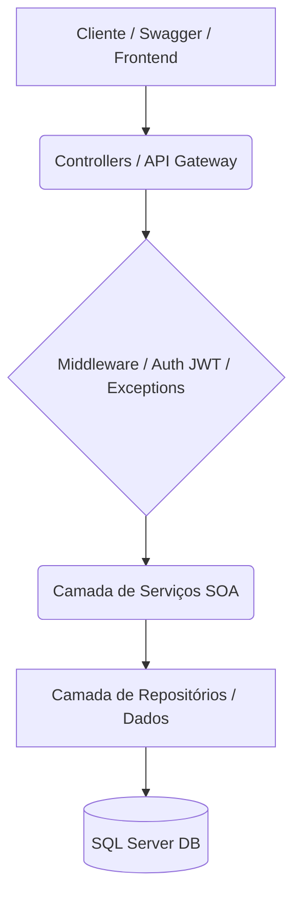
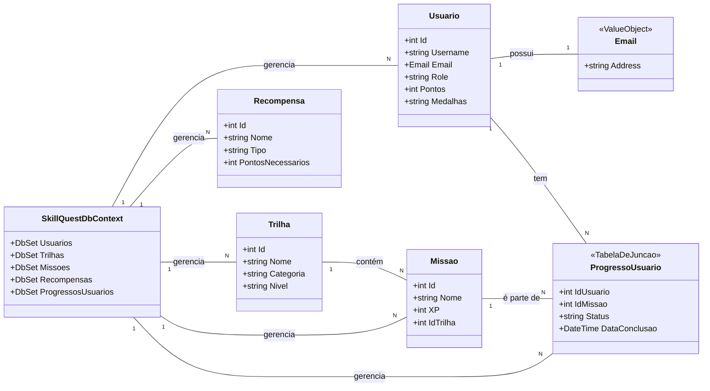

# SkillQuest – O Duolingo das Carreiras do Futuro
*Plataforma gamificada de aprendizado de habilidades do futuro*

---

## 🚀 Descrição Completa do Projeto

### Objetivo da Aplicação
O **SkillQuest** é uma plataforma de microlearning gamificada, desenhada para ajudar profissionais e estudantes a desenvolverem as competências (técnicas e *soft skills*) exigidas pelo "Futuro do Trabalho". A aplicação funciona como um "Duolingo para carreiras", onde o utilizador não apenas consome conteúdo, mas o faz através de uma jornada gamificada e personalizada.

### Conceito de Gamificação
O núcleo do SkillQuest é um ciclo de engajamento contínuo:
1.  **Trilhas:** O utilizador escolhe uma "Trilha" de conhecimento (ex: "Fundamentos de IA").
2.  **Missões:** Dentro da trilha, ele completa "Missões" (lições curtas, quizzes, etc.).
3.  **Pontos (XP):** Ao completar uma missão, ele ganha pontos de experiência (XP).
4.  **Progresso:** O seu progresso é salvo, e os seus pontos totais aumentam.
5.  **Recompensas:** Com os pontos acumulados, o utilizador pode "resgatar" recompensas na loja (medalhas, cupões, etc.).

### Funcionamento Geral do Sistema
Esta API RESTful, construída em ASP.NET Core, é o "cérebro" da plataforma. Ela é responsável por:
* Gerir o catálogo de `Trilhas`, `Missões` e `Recompensas`.
* Controlar o `ProgressoUsuario` em cada missão.
* Implementar as regras de negócio de gamificação (atribuição de `Pontos`, resgate de `Recompensas`).
* Fornecer um sistema de autenticação seguro com **JWT** e **Perfis de Acesso (Roles)**: `Admin`, `Aluno` e `EmpresaParceira`.
* Simular uma **IA** para recomendação de novas trilhas com base no desempenho.

### Proposta de Impacto
Numa era de rápida automação e ascensão da IA, a requalificação profissional contínua tornou-se essencial. O SkillQuest ataca diretamente este problema, tornando o aprendizado de novas competências (tanto técnicas quanto *soft skills* focadas no futuro do trabalho) mais rápido, acessível e, acima de tudo, engajante.

---

## 🛠️ Tecnologias Utilizadas

* **C# 12** e **.NET 8** (compatível com .NET 9)
* **ASP.NET Core Web API**: Para a construção dos endpoints RESTful.
* **Entity Framework Core 8**: ORM para comunicação com a base de dados (Code-First).
* **SQL Server**: Banco de dados relacional (configurado para `(localdb)`).
* **Swagger (Swashbuckle)**: Para documentação e testes de API.
* **JWT (JSON Web Tokens)**: Para autenticação e autorização *stateless*.
* **BCrypt.Net-Next**: Para hashing seguro de senhas.
* **Arquitetura Orientada a Serviços (SOA)**: O núcleo do design.
* **Padrões de Clean Architecture**: Repository Pattern, Injeção de Dependência (DI), DTOs e Value Objects (VOs).

---

## 📁 Estrutura da Solução

A API segue uma estrutura de pastas modular para separar responsabilidades:

```
/SkillQuest.Api
├── /Controllers
│   ├── /v1
│   │   ├── AuthController.cs
│   │   ├── UsuariosController.cs
│   │   ├── TrilhasController.cs
│   │   ├── MissoesController.cs
│   │   ├── RecompensasController.cs
│   │   ├── ProgressosController.cs
│   │   └── RecomendacoesController.cs
├── /Models
│   ├── /ValueObjects
│   │   └── Email.cs
│   ├── Usuario.cs
│   ├── Trilha.cs
│   ├── Missao.cs
│   ├── Recompensa.cs
│   ├── ProgressoUsuario.cs
│   └── UserRoles.cs
├── /DTOs
│   ├── RegisterDto.cs
│   ├── LoginDto.cs
│   ├── TokenResponseDto.cs
│   ├── UsuarioDto.cs
│   ├── TrilhaDto.cs
│   ├── CreateMissaoDto.cs
│   └── ... (etc.)
├── /Services
│   ├── IUsuarioService.cs
│   ├── UsuarioService.cs
│   ├── ITrilhaService.cs
│   ├── TrilhaService.cs
│   ├── IProgressoService.cs
│   ├── ProgressoService.cs
│   ├── IRecompensaService.cs
│   ├── RecompensaService.cs
│   ├── IRecomendacaoService.cs
│   ├── RecomendacaoService.cs
│   ├── ITokenService.cs
│   └── TokenService.cs
├── /Repositories
│   ├── IUsuarioRepository.cs
│   ├── UsuarioRepository.cs
│   ├── ITrilhaRepository.cs
│   ├── TrilhaRepository.cs
│   ├── ... (etc.)
│   └── SkillQuestDbContext.cs
├── /Middleware
│   └── GlobalExceptionMiddleware.cs
├── appsettings.json
└── Program.cs
```

---

## 🌐 Endpoints Principais (API v1)

A tabela abaixo resume os *endpoints* essenciais e suas regras de autorização.

| Verbo | Rota | Permissão | Descrição |
| :--- | :--- | :--- | :--- |
| `POST` | `/api/v1/auth/register` | **Público** | Regista um novo utilizador (Aluno, Admin). |
| `POST` | `/api/v1/auth/login` | **Público** | Autentica e retorna um Token JWT. |
| `GET` | `/api/v1/usuarios` | **Admin** | Lista todos os utilizadores da plataforma. |
| `GET` | `/api/v1/trilhas` | **Público** | Lista o catálogo público de trilhas. |
| `POST`| `/api/v1/trilhas` | **Admin** | (Admin) Cria uma nova trilha. |
| `GET` | `/api/v1/trilhas/{id}/missoes` | **Público** | Lista as missões de uma trilha. |
| `POST`| `/api/v1/trilhas/{id}/missoes` | **Admin** | (Admin) Adiciona uma missão a uma trilha. |
| `POST`| `/api/v1/progressos/missoes/{id}/completar` | **Aluno** | (Aluno) Regista a conclusão da missão e ganha XP. |
| `GET` | `/api/v1/recompensas` | **Público** | Lista a "loja" de recompensas. |
| `POST`| `/api/v1/recompensas/{id}/resgatar` | **Aluno** | (Aluno) Resgata uma recompensa usando os pontos ganhos. |
| `GET` | `/api/v1/recomendacoes/proxima-trilha` | **Aluno** | (IA Simulada) Sugere a próxima trilha para o aluno. |

---

## ⚙️ Instruções para Rodar o Projeto

### 1. Pré-requisitos
* [.NET 8 SDK](https://dotnet.microsoft.com/download/dotnet/8.0)
* [SQL Server Express (LocalDB)](https://learn.microsoft.com/pt-br/sql/database-engine/configure-windows/sql-server-express-localdb)

### 2. Instalar Dependências
Rode no terminal, na raiz do projeto:
```bash
dotnet restore
```

### 3. Migrations e Banco de Dados
O projeto usa EF Core Code-First. Para criar o banco de dados e as tabelas pela primeira vez:
```bash
dotnet tool install --global dotnet-ef
```
```bash
dotnet ef migrations add InitialCreate
```
```bash
dotnet ef database update
```

### 4. Rodar o servidor
```bash
dotnet run
```

### 5. Aceder ao Swagger
Aceda à documentação interativa no seu navegador:

URL: https://localhost:5001/swagger (ou a porta indicada no terminal)

---

## 🏗️ Arquitetura e Diagramas
O projeto segue uma Arquitetura Orientada a Serviços (SOA) modular, onde a API serve como o gateway central que orquestra serviços de negócio independentes.

### Diagrama de Arquitetura de Serviços (SOA)
Este diagrama ilustra o fluxo de alto nível, desde o cliente até a base de dados, passando pelas camadas de lógica de negócio e autenticação.



### Diagrama UML de Entidades (Classes Principais)
Este diagrama mostra as 5 entidades principais do domínio, o Value Object `Email`, e como elas se relacionam dentro do `SkillQuestDbContext`.



---

## 📌 Diagrama de Fluxo da Aplicação

Legenda:

* **[Utilizador]** = O ator (Frontend/Swagger)
* **[Gateway API]** = O Controller (ex: AuthController)
* **[Serviço]** = A "caixa" da regra de negócio (SOA) (ex: IUsuarioService)
* **[Repositório]** = A camada de acesso a dados (ex: IUsuarioRepository)
* **[DB]** = A Base de Dados (SQL Server)

### Fluxo 1: Registo de Utilizador
```bash
[Utilizador] -> POST /api/v1/auth/register (com RegisterDto)
    |
    v
[Gateway API: AuthController]
    |
    v
[Serviço: IUsuarioService]
    |
    +--- (1. Chama BCrypt.HashPassword())
    |
    +--- (2. Chama [Repositório: IUsuarioRepository])
            |
            v
        [DB: Tabela Usuarios] (Grava novo 'Usuario')
    |
    v
(Retorna 201 Created com UsuarioDto) -> [Utilizador]
```

### Fluxo 2: Login e Autenticação JWT
```bash
[Utilizador] -> POST /api/v1/auth/login (com LoginDto)
    |
    v
[Gateway API: AuthController]
    |
    v
[Serviço: IUsuarioService]
    |
    +--- (1. Chama [Repositório: IUsuarioRepository] (GetByEmailAsync))
    |       |
    |       v
    |   [DB: Tabela Usuarios] (Lê 'Usuario')
    |
    +--- (2. Recebe 'Usuario' e chama BCrypt.Verify())
    |
    +--- (3. Se válido, chama [Serviço: ITokenService])
            |
            v
        (Gera Token JWT com ID e Role)
    |
    v
(Retorna 200 OK com TokenResponseDto) -> [Utilizador]
```

### Fluxo 3: Comunicação SOA (Gamificação - Completar Missão)
Este fluxo mostra como múltiplos serviços e tabelas interagem de forma modular e transacional (Princípio SOA).
```bash
[Utilizador (Aluno)]
    |
    (Envia Token JWT)
    |
    v
[Middleware JWT] -> (Valida Token e 'Role: Aluno')
    |
    v
POST /api/v1/progressos/missoes/{id} -> [Gateway API: ProgressosController]
    |
    v
[Serviço: IProgressoService] (Inicia Transação com DbContext)
    |
    | // Regra de Negócio:
    |
    +--- (1. Consulta 'Missao' para obter XP) -> [DB: Tabela Missoes]
    |
    +--- (2. Consulta 'Usuario' para obter Pontos atuais) -> [DB: Tabela Usuarios]
    |
    +--- (3. Cria 'ProgressoUsuario' novo) -> [DB: Tabela ProgressosUsuarios]
    |
    +--- (4. Atualiza 'Usuario.Pontos' = Pontos + XP) -> [DB: Tabela Usuarios]
    |
[Serviço: IProgressoService] (Commit Transação)
    |
    v
(Retorna 200 OK com ProgressoDto) -> [Utilizador (Aluno)]
```

### Fluxo 4: Comunicação SOA (Gamificação - Resgatar Recompensa)
```bash
[Utilizador (Aluno)]
    |
    (Envia Token JWT)
    |
    v
[Middleware JWT] -> (Valida Token e 'Role: Aluno')
    |
    v
POST /api/v1/recompensas/{id}/resgatar -> [Gateway API: RecompensasController]
    |
    v
[Serviço: IRecompensaService] (Inicia Transação com DbContext)
    |
    | // Regra de Negócio:
    |
    +--- (1. Consulta 'Usuario' para obter Pontos) -> [DB: Tabela Usuarios]
    |
    +--- (2. Consulta 'Recompensa' para obter Custo) -> [DB: Tabela Recompensas]
    |
    +--- (3. Verifica se Pontos >= Custo)
    |
    +--- (4. Atualiza 'Usuario.Pontos' = Pontos - Custo) -> [DB: Tabela Usuarios]
    |
[Serviço: IRecompensaService] (Commit Transação)
    |
    v
(Retorna 200 OK com ResgateDto) -> [Utilizador (Aluno)]
```

---

## 🎥 Vídeo de Demonstração
Assista a uma demonstração do fluxo completo da API, mostrando o Admin a criar conteúdo e o Aluno a executar a gamificação.

👉 LINK DO YOUTUBE: https://youtu.be/TY30gvCi-y8

---

## 📦 Versionamento da API
A API utiliza versionamento explícito via URL para garantir a estabilidade de clientes futuros.

* v1 (atual): /api/v1/...
* v2 (futuro): /api/v2/...

---

## 👥 Integrantes do Grupo

* **Enzo Luiz Goulart** - `RM99666`
* **Lucas Yuji Farias Umada** - `RM99757`
* **Gustavo Henrique Santos Bonfim** - `RM98864`
